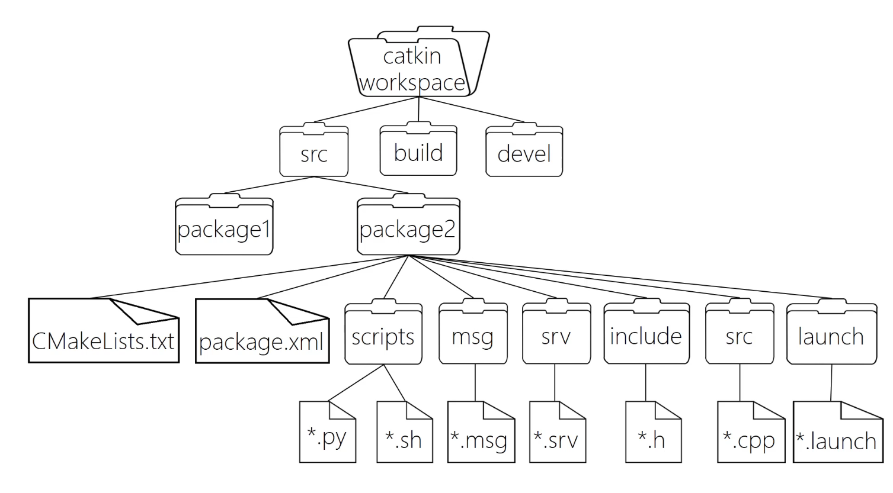

# ROS-1&ROS-2 學習筆記

Linux環境 : `Ubuntu 18.04`

ROS-1 version : `Medolic`

ROS-2 version : `Dashing`

## 安裝ROS-1&ROS-2
```shell
sh build_ros1.sh # 安裝 ROS-1
sh build_ros2.sh # 安裝 ROS-2
```

## 設置ROS-1與ROS-2編譯環境
```shell
echo "alias initros1='source /opt/ros/melodic/setup.bash'" >> ~/.bashrc
echo "alias initros2='source ~/ros2_ws/install/local_setup.bash'" >> ~/.bashrc
```
使用`initros1`指令來建立ROS-1的編譯環境

使用`initros2`指令來建立ROS-2的編譯環境

## Workspace 
### 建立Workspace
```shell
mkdir -p {workspace name}/src
cd {workspace name}/src
catkin_init_workspace
catkin_create_pkg {project_name} rospy # rospy後面可加入其他package, ex:roscpp
```

### 編譯Workspace
```shell
cd {workspace name} # 到workspace的根目錄
catkin_make
sorce devel/setup.bash
```

### 執行
使用`rosrun`時要確認`roscore`是否在執行中
```shell
rosrun {project_name} {Python_file}.py
rosrun {project_name} {Cpp_file}.cpp
```

### ROS-1 文件系統


## Reference
* https://www.ros.org/
